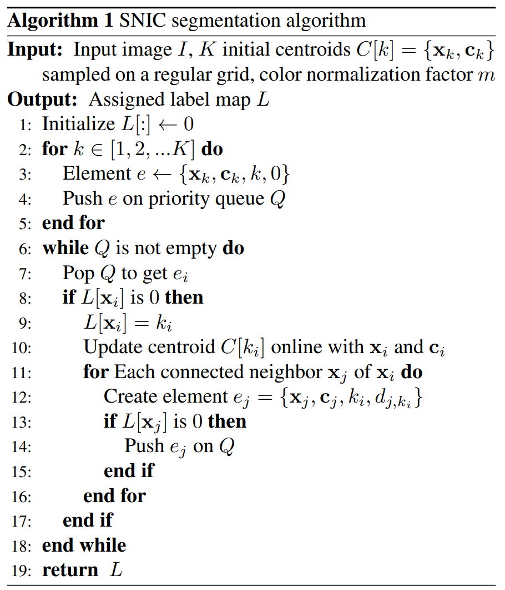

# SNIC
Superpixels and Polygons using Simple Non-Iterative Clustering, Radhakrishna Achanta and Sabine Susstrunk
In this project, we implement Simple Non-iterative Clustering (SNIC) algorithm which
is an improved version of the Simple Linear Iterative Clustering (SLIC) superpixel
segmentation. The algorithm is faster than SLIC, is non-iterative and enforces
connectivity from the start. 

  

References:

[1] Achanta, Radhakrishna & Susstrunk, Sabine. (2017). Superpixels and Polygons Using
Simple Non-iterative Clustering. 4895-4904. 10.1109/CVPR.2017.520.

[2] Achanta, Radhakrishna & Shaji, Appu & Smith, Kevin & Lucchi, Aurélien & Fua,
Pascal & Susstrunk, Sabine. (2012). SLIC Superpixels Compared to State-of-the-Art
Superpixel Methods. IEEE transactions on pattern analysis and machine Intelligence. 34.
10.1109/TPAMI.2012.120.

[3] D. Martin, C. Fowlkes, D. Tal, and J. Malik. A database of human segmented natural
images and its application to evaluating segmentation algorithms and measuring
ecological statistics. In IEEE International Conference on Computer Vision (ICCV), July
2001.

This project was successfully completed under the supervision of Dr. Rajendra Nagar, by Muskan Chitara and Manasi Khobragade (Indian Institute of Technology Jodhpur).
